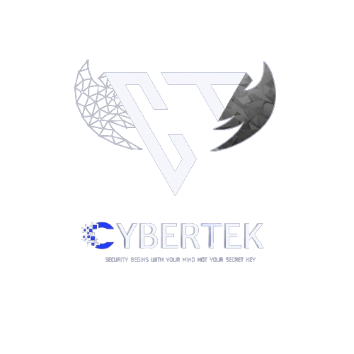

# CYBERTTEK CTF-2024

This repository contains the challenges from Securinets TEK-UP CTF CyberTEK 2024

---
## Info
- Event place: TEK-UP University.
- Event duration: `14hrs`.
- Flag format: Securinets{.*}.
___

### Challenges

| Category   | Challenge        | Points | Solves |  Author |
|------------|------------------|--------|--------|---------|
|   misc     |    discord       |   1    |   22   |    -    |
|   misc     |    [PERMS](challenges/misc/PERMS)         |   10   |   22   | xhlayel |
|   misc     |    [HEIMERDIggER](challenges/misc/heimerdigger)  |  146   |   18   | xhlayel, chxmxii |
|   misc     |    [Siclodb](challenges/misc/siclodb)       |  500   |   1    | chxmxii |
|   misc     |    [Openheimer](challenges/misc/openheimer)    |  440   |   6    | chxmxii |
|   misc     |    [bolbok](challenges/misc/bolbok)        |  470   |   4    | chxmxii |
|   misc     |    [ekko](challenges/misc/ekko)          |  494   |   7    | chxmxii |
|   misc     |    [LEE SIN](challenges/misc/LEE%20SIN)       |  481   |   5    | xhlayel |
|   web      |    [psyducklove](challenges/web/psyducklove)   |  500   |   0    | j3seer  |
|   web      |    [B17](challenges/web/B17)           |  352   |   12   | xhlayem |
|   web      |    [reCURSED](challenges/web/reCURSED)      |  378   |   11   | xhlayel |
|   web      |    [Random Quotes](challenges/web/Random%20Quotes) |  481   |   5    | xhlayel |
|   web      |    [Yessuou](challenges/web/Yessuou)       |  489   |   4    | xhalyl, GremlinBoi|
|   crypto   |    [Classic RSA2](challenges/crypto/Classic%20RSA2)  |  225   |   16   | GermlinBoi|
|   crypto   |    [warmup](challenges/crypto/warmup)        |  422   |   9    | GermlinBoi| 
|   crypto   |    [Classic RSA1](challenges/crypto/Classic_RSA_1) |  440   |   8    | GermlinBoi|
|   crypto   | [Prideful Revenge](challenges/crypto/Prideful%20Revenge) |  489   |   4    | GermlinBoi|
|   crypto   | [Holes In Reality](challenges/crypto/Holes%20In%20Reality) |  496   |   3    | GermlinBoi|
|   crypto   | [ATOMIC](challenges/crypto/ATOMIC)           |  499   |   2    | GermlinBoi|
|   crypto   | [SBG Secret Formula](challenges/crypto/SBG_Secret_Formula) |  499   |   1    | M0ud4|
|   crypto   | [A Different Breed](challenges/crypto/A%20Different%20Breed) |  499   |   2    | GermlinBoi|   
|   pwn      | [championWarmup](challenges/pwn/championWarmup)   |  499   |   2    | retr0|
|   pwn      | [heapStar](challenges/pwn/heapStar)         |  499   |   2    | retr0|
|   pwn      | [marketManager](challenges/pwn/marketManager)    |  499   |   2    | retr0|
|   pwn      | [retr0GPT](challenges/pwn/retr0GPT)         |  499   |   2    | retr0|
|   4n6      | [Low Level](challenges/4n6/Low_Level)        |  10    |   23   | cybereagle2001|
|   4n6      | [The logs](challenges/4n6/The_logs)         |  240   |   14   | 0S1rx58|
|   4n6      | [1NV3ST1G4T0R](challenges/4n6/1NV3ST1G4T0R)     |  489   |   4    | cybereagle2001|
|   rev      | [Jsonifier](challenges/reverse/)        |  104   |   19   | sonic|
|   rev      | [PyA-ok-PyB-ok-PyC-?](challenges/reverse/) | 104 |   19   | AlternoX|
|   rev      | [Cassiopeia](challenges/reverse/Cassiopeia)       |  422   |   9    | S4L1M|
|   rev      | [Don't Give UP](challenges/reverse/Dont%20Give%20UP)    |  496   |   3    | S4L1M|
|   rev      | [Cursed But Strongly Connected](challenges/reverse/Cursed_But_Strongly_Connected) | 500 | 0 | M0ud4|
|   rev      | [DominosPhrydos](challenges/reverse/DominosPhrydos) | 500 | 1 | S4L1M |

---

  

   